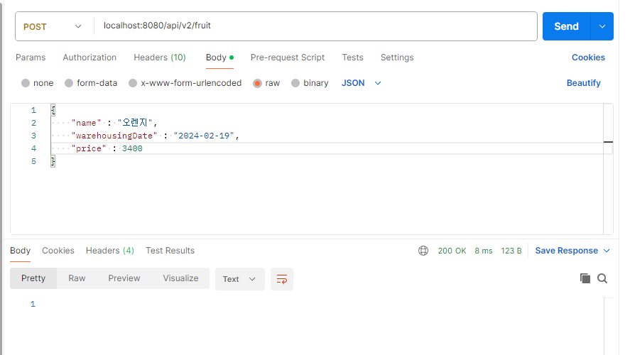
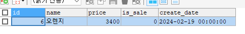
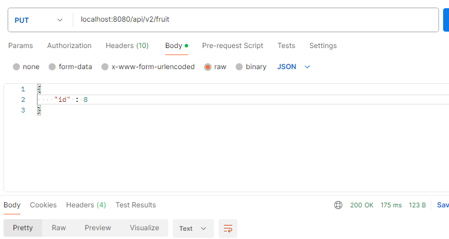
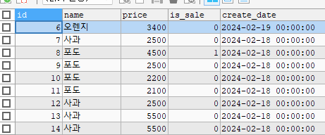
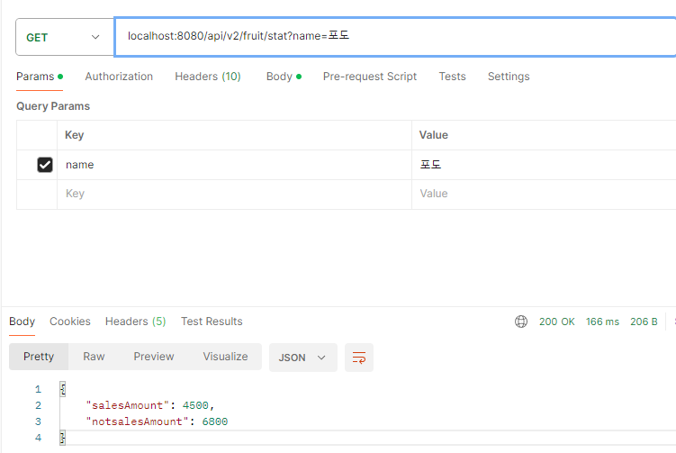
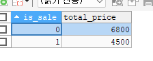

# BE 과제 #4 [인프런 워밍업 클럽 - 0기]

인프런 워밍업 클럽 0기 BE 과제 #4 소스 및 결과  
기존 다른 패키지에서 /api/v1을 사용중이므로 /api/v2로 진행  
소스 - 모두 FruitController로 시작. 메소드의 정의 순서가 문제 결과 순서  

## 문제1 결과
요청  

결과(id 1~5는 테스트용으로 제거)  

### 한걸음 더
long을 사용하는 이유  
범위의 차이라 생각합니다.  
int형을 사용하면 21억정도가 넘어가는 순간 오버플로우 에러가 납니다.  
21억이란 숫자는 크지만 충분히 들어올 수 있는 범위기 때문에  
포용 범위가 더 넓은 long으로 사용하는 것이 맞다고 생각합니다.  
실제 업무를 하면서 금액이 21억이 넘는 경우가 있어 에러가 났던 경험이 있습니다.  
(이 외에 다른 이유가 있으면 피드백 요청드립니다!)

## 문제2 결과
is_sale - bool 타입으로 관리 0 - false , 1 - true
요청  

결과  

## 문제3 결과
결과  
API  

DB(0 - false(팔리지 않은 것) / 1 - true)  

SUM 과 GROUP BY를 사용해서 결과를 받다보니 소스가 조금 이상해진 것 같습니다..  
문제3의 소스가 마음에 들지 않아 더 좋은 방법의 피드백 주시면 고쳐보겠습니다