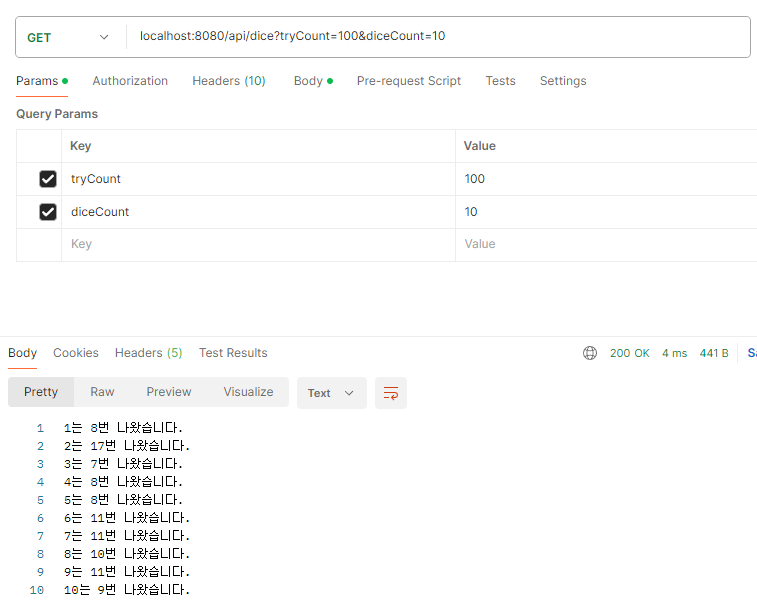

# BE 과제 #5 리팩터링 [인프런 워밍업 클럽 - 0기]

## 개요
과제 소스들을 한 레포지토리에 묶고싶어 homework5 패키지에 Controller 작성해서 진행했습니다  
동작방식은 [결과](#결과)와 같습니다(쿼리스트링으로 시도횟수, 주사위개수 입력)

## 소스 설명
### 설명
어디까지 손을 대야 하나 생각했지만 간단하게 반복하는 과정을 줄이는 것에 포인트를 맞췄습니다.  
다른 역할을 한다 싶으면 함수로 나눴습니다(유지보수 할 때 영향을 미치지 않는 부분으로 포인트)  
- 시도횟수, 주사위개수 모두 사용자 입력값으로 받도록 생성 (개발자 입장에서는 숫자 변화로 유지보수 할 일이 없도록)
- rollByCount - 시도횟수만큼 주사위를 굴려 어느 주사위가 몇 번 나왔는지 결과를 담아 내어주는 메서드
- writeResult - 결과를 사용자가 볼 수 있는 문구로 바꿔주는 메서드

주사위, 카운트 등 객체에 맞춰 값객체 생성, 역할에 따른 클래스 분리?  
해보려다가 너무 깊어지고 정답이 없는 부분이라 결과물의 기준을 잡기 힘들어 넘어갔습니다(잘 모르기도합니다..)

### 소스
[소스(DiceController)](./DiceController.java)

## 결과
